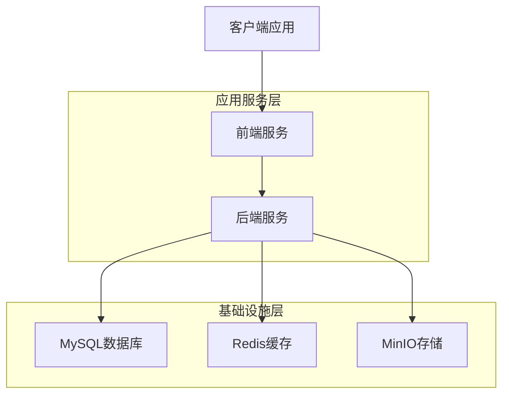

# 部署指南

## 概述

本文档详细介绍屏幕监控系统的部署方法和配置选项。

## 部署架构

### 服务组件



### Docker Compose 文件说明

| 文件 | 用途 | 包含服务 |
|------|------|----------|
| `docker-compose.yml` | 基础设施服务 | MySQL + Redis + MinIO |
| `docker-compose.dev.yml` | 开发环境配置 | 端口映射 + 管理工具 |
| `docker-compose.app.yml` | 生产应用服务 | Backend + Frontend |
| `docker-compose.app.dev.yml` | 开发应用服务 | Backend-dev + Frontend-dev |

## 部署模式详解

### 1. 开发环境部署

#### 模式一：基础设施 + 本地开发
```bash
# 启动基础设施
./deployment/scripts/start.sh dev infra

# 本地运行后端（支持调试）
cd backend
npm install
npm run start:dev

# 本地运行前端（支持热重载）  
cd frontend
npm install
npm run dev
```

**适用场景**：
- IDE调试开发
- 代码修改频繁
- 需要断点调试

**端口映射**：
- MySQL: localhost:33066
- Redis: localhost:36379  
- MinIO API: localhost:39000
- MinIO Console: localhost:39090
- Adminer: localhost:38080
- Redis Commander: localhost:38081

#### 模式二：容器化应用开发
```bash
# 启动应用服务（包含基础设施）
./deployment/scripts/start.sh dev app
```

**适用场景**：
- 接近生产环境的开发
- 多人协作开发
- 集成测试

**端口映射**：
- 前端应用: localhost:38000
- 后端API: localhost:38001
- 后端调试: localhost:39229

#### 模式三：完整开发环境
```bash
# 启动全部服务
./deployment/scripts/start.sh dev all
```

**包含所有基础设施、应用服务和管理工具**

### 2. 生产环境部署

#### 标准生产部署
```bash
# 一键部署完整生产环境
./deployment/scripts/start.sh prod app
```

**特性**：
- 前后端直接对接，无需复杂反向代理
- 内置负载均衡和健康检查
- 优化的Docker镜像构建

**端口映射**：
- 应用主页: localhost:8080
- API接口: localhost:3001
- MinIO控制台: localhost:9090

#### 仅基础设施部署
```bash
# 仅启动基础设施，用于自定义应用部署
./deployment/scripts/start.sh prod infra
```

## 环境变量配置

### 基础配置(.env)
```bash
# 数据库配置
MYSQL_ROOT_PASSWORD=rootPassword123
MYSQL_DATABASE=screen_monitoring
MYSQL_USER=monitor_user
MYSQL_PASSWORD=monitorPass123

# MinIO配置
MINIO_ROOT_USER=minioadmin
MINIO_ROOT_PASSWORD=minioadmin123
MINIO_DEFAULT_BUCKETS=monitoring-screenshots

# 应用配置
JWT_SECRET=your-super-secret-jwt-key
NODE_ENV=production

# 端口配置
FRONTEND_PORT=8080
BACKEND_PORT=3001
```

### 开发环境配置(.env.dev)
```bash
# 开发环境使用冷门端口避免冲突
MYSQL_PORT=33066
REDIS_PORT=36379
MINIO_API_PORT=39000
MINIO_CONSOLE_PORT=39090

# 开发数据库
MYSQL_DATABASE=screen_monitoring_dev
MYSQL_USER=dev_user
MYSQL_PASSWORD=dev_pass_123
```

## 数据持久化

### 数据卷说明
```yaml
volumes:
  mysql_data:          # MySQL数据文件
  redis_data:          # Redis持久化数据
  minio_data:          # MinIO对象存储数据
  backend_node_modules: # 后端依赖（开发环境）
  frontend_node_modules: # 前端依赖（开发环境）
```

### 备份策略
```bash
# 数据库备份
docker-compose exec mysql mysqldump -u root -p screen_monitoring > backup.sql

# MinIO数据备份
docker-compose exec minio mc mirror /data /backup

# 数据卷备份
docker run --rm -v mysql_data:/data -v $(pwd):/backup alpine tar czf /backup/mysql_backup.tar.gz -C /data .
```

## 网络配置

### Docker网络
- 网络名称：`screen-monitor-network`
- 驱动类型：`bridge`
- 服务间通信：通过容器名访问

### 服务发现
- 后端访问数据库：`mysql:3306`
- 后端访问Redis：`redis:6379`
- 后端访问MinIO：`minio:9000`
- 前端访问后端：`backend:3001`

## 健康检查

### MySQL健康检查
```yaml
healthcheck:
  test: ["CMD", "mysqladmin", "ping", "-h", "localhost"]
  interval: 30s
  timeout: 10s
  retries: 5
```

### 应用健康检查
```yaml
healthcheck:
  test: ["CMD", "curl", "-f", "http://localhost:3001/health"]
  interval: 30s
  timeout: 10s
  retries: 3
  start_period: 40s
```

## 故障排除

### 常见问题

1. **端口冲突**
   ```bash
   # 检查端口占用
   netstat -tulpn | grep :3306
   # 或修改.env中的端口配置
   ```

2. **容器启动失败**
   ```bash
   # 查看服务状态
   docker-compose ps
   # 查看服务日志
   docker-compose logs mysql
   ```

3. **数据库连接失败**
   ```bash
   # 检查数据库容器健康状态
   docker-compose exec mysql mysqladmin ping
   # 检查网络连接
   docker-compose exec backend ping mysql
   ```

4. **MinIO访问问题**
   ```bash
   # 检查MinIO健康状态
   docker-compose exec minio curl -f http://localhost:9000/minio/health/live
   ```

### 调试命令
```bash
# 查看所有服务状态
docker-compose ps

# 查看特定服务日志
docker-compose logs -f backend

# 进入容器调试
docker-compose exec backend sh

# 重启特定服务
docker-compose restart mysql

# 查看网络配置
docker network inspect screen-monitor-network
```

## 性能优化

### 生产环境优化
- 启用MySQL查询缓存
- 配置Redis持久化策略
- MinIO启用CDN加速
- 应用服务资源限制

### 监控指标
- 容器资源使用情况
- 数据库连接池状态
- MinIO存储使用情况
- 应用响应时间

## 安全配置

### 网络安全
- 使用内部Docker网络通信
- 最小化暴露端口
- 配置防火墙规则

### 数据安全
- 数据库密码加密存储
- MinIO访问密钥管理  
- JWT Token安全配置
- HTTPS证书配置（生产环境）